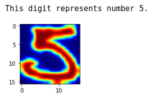
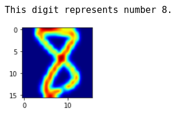

# Classification of Handwritten Digits with SVD

In this project I construct an algorithm for [classification of handwritten digits](Classification-of-Handwritten-Digits-with-SVD.ipynb). Using a training set, I compute the SVD of each class matrix. I use the first few (5-20) singular vectors as basis and classify unknown test digits according to how well they can be represented in terms of the respective bases (I use the relative residual vector in the least squares problem as a measure).

## Specific Tasks

* Task 1: I tune the algorithm for accuracy of classification. 
* Task 2: I check if all digits are equally easy or difficult to classify. 
* Task 3: I check the singular values of the different classes. I also perform a few experiments to find out if it really pays off to use fewer basis vectors in one or two of the classes

## Data

### Raw 

The input data are included in four sheets of the xls file [data](data.xlsx)

* Sheets dzip is a vector that holds the digits (the number) for training.
* Sheets azip is an array of dimension 256 x 1707 that holds the training images for training.



The images are vectors of dimension 256, that have been constructed from 16 x 16 images.

* Sheets dtest is a vector that holds the digits (the number) for testing.
* Sheets testzip is an array of dimension 256 x 1707 that holds the training images for testing.



The data are a subset of the US Postal Service Database.

### Processed

I merge the two datasets and then split them in an analogy 80%/20% for training/test set.

I also include an [html version](Classification-of-Handwritten-Digits-with-SVD.html) of the project.

## Scripts


You can either open the [Jupyter notebook](Classification-of-Handwritten-Digits-with-SVD.ipynb) or run the [script](Classification-of-Handwritten-Digits-with-SVD.py) as following:

```
python3 Classification-of-Handwritten-Digits-with-SVD.py
```

## Requirements:

`Classification-of-Handwritten-Digits-with-SVD.py` and `Classification-of-Handwritten-Digits-with-SVD.ipynb`were developed using Python 3.8.6 on Ubuntu 20.04.1 LTS.

They have been tested with the following package versions:

* numpy == 1.19.4
* matplotlib == 3.3.2
* pandas == 1.1.4
* scipy == 1.5.3
* scikit-learn == 0.23.2
* sklearn == 0.0
* tabulate == 0.8.7
* progressbar == 3.53.1

To install them run in a shell:

```
pip install -r requirements.txt
```
